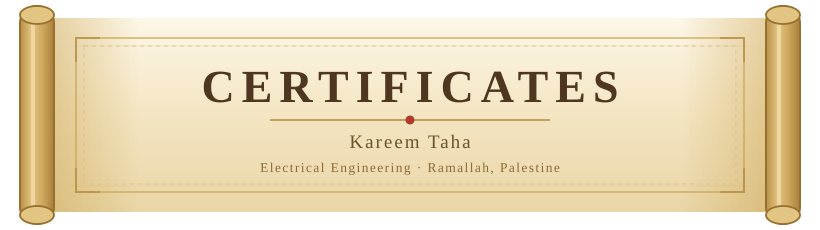
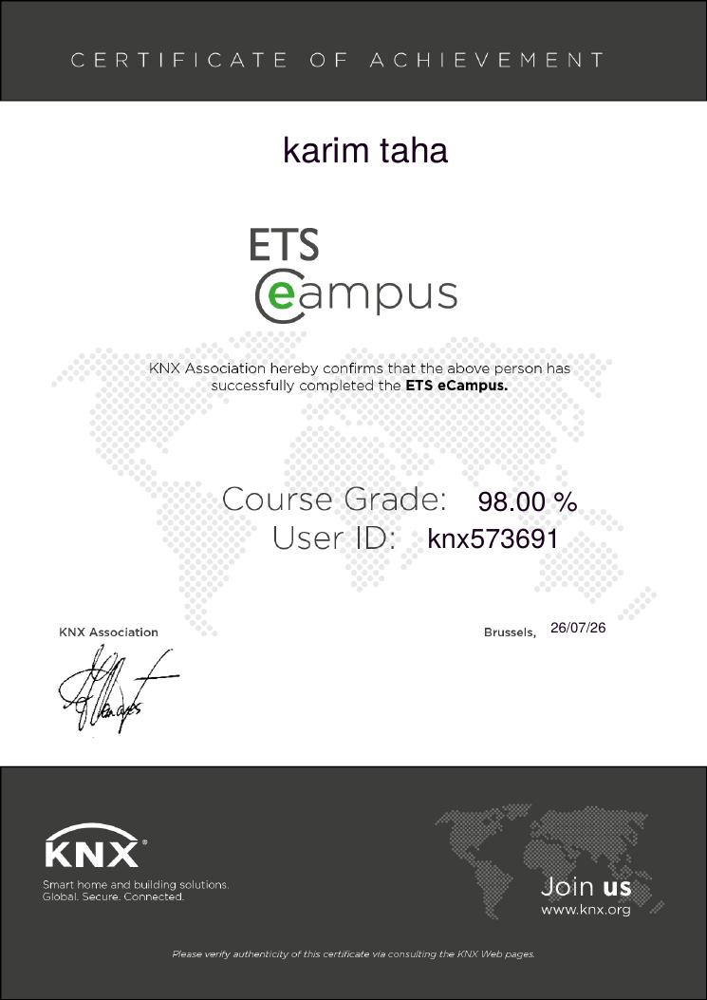
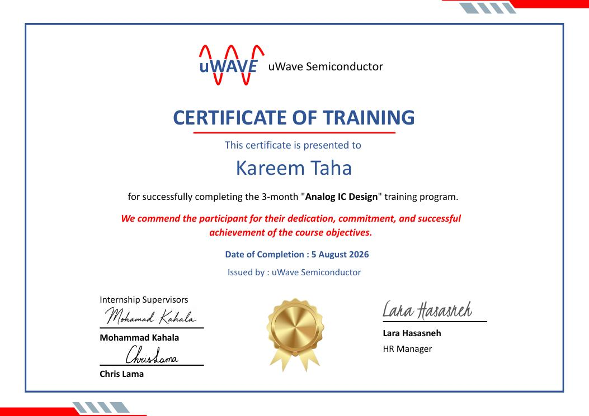
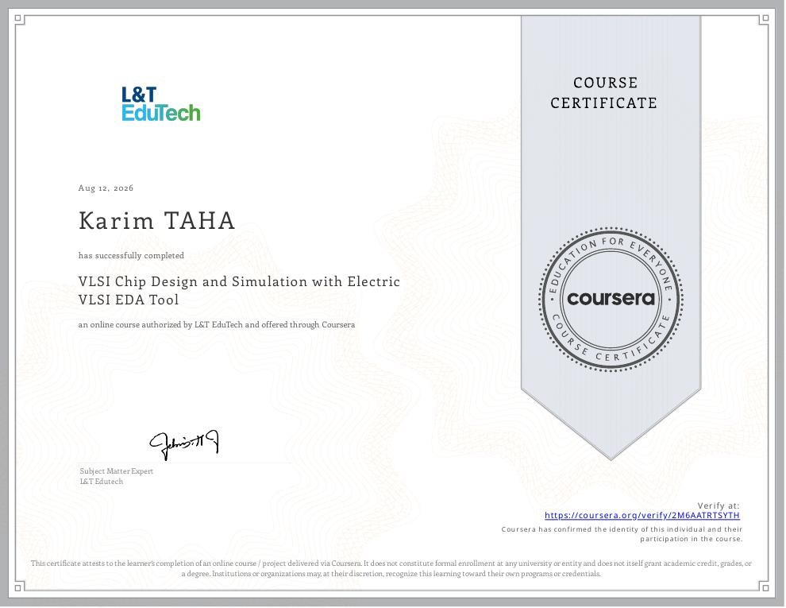
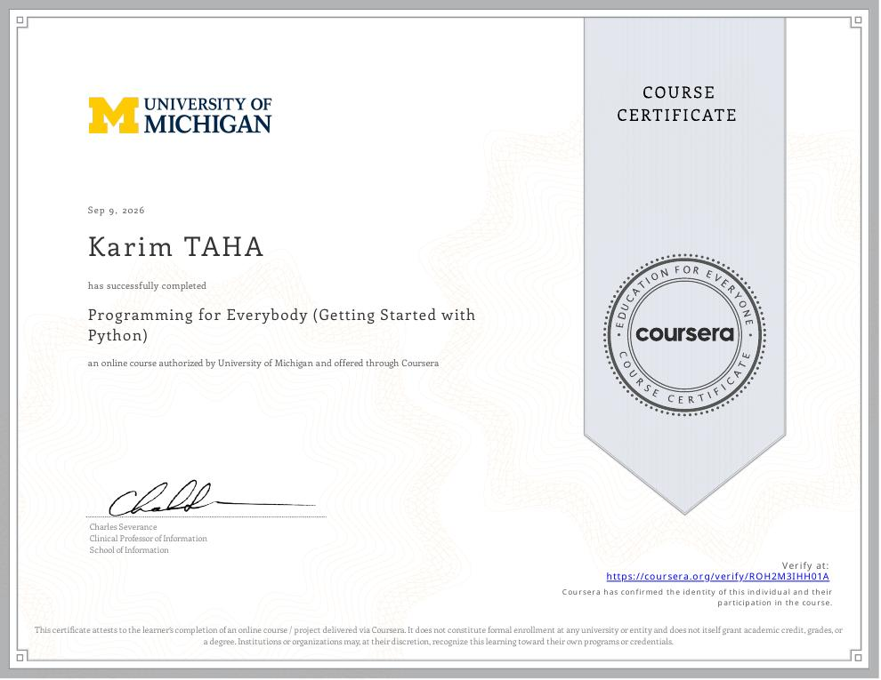

  

 

---

## 🏢 &nbsp;ETS eCampus

  

Certificate of Achievement for completing the ETS eCampus programme — KNX system fundamentals, ETS project design, device configuration, and commissioning for smart building automation.

  

 

 

---

## 📐 &nbsp;Analog IC Design — Training Programme

  

Certificate of Training for the three-month Analog IC Design programme — transistor-level amplifier design, DC/AC and frequency-response simulation, and mixed-signal design flow in Synopsys Custom Compiler.

  

 

 

---

## 🔬 &nbsp;VLSI Chip Design &amp; Simulation with Electric VLSI EDA Tool

  

Schematic capture, physical layout, and simulation of CMOS circuits using the Electric VLSI EDA tool, including the DRC and LVS verification workflow.

  

 

 

---

## 🐍 &nbsp;Programming for Everybody (Getting Started with Python)

  

Python fundamentals — variables, control flow, functions, and core data structures — taught by Dr. Charles Severance, University of Michigan School of Information.

 

 

 

---

  

Ramallah, Palestine 🇵🇸

