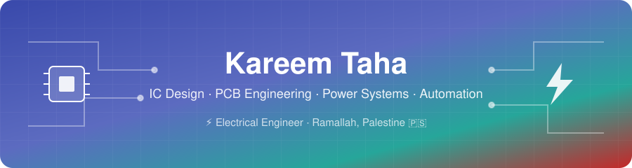

  

  
  
  

### Electrical Engineering graduate with hands-on experience spanning multiple tiers of electrical hardware design — from transistor-level IC/VLSI design and embedded firmware to PCB development, low-voltage power distribution, and building automation.

---

## 🛠️ Technical Capabilities

<table width="100%">
<tr>
<td width="50%" valign="top" align="center">

**Synopsys Custom Compiler**
**Electric VLSI**
**LTspice**
**OrCAD PSpice**
**CMOS / Analog IC Design**

</td>
<td width="50%" valign="top" align="center">

**ESP32-S3**
**C / C++**
**KiCad**
**EasyEDA**
**Python**

</td>
</tr>
<tr>
<td width="50%" valign="top" align="center">

**ETAP**
**PowerWorld Simulator**
**Load Flow Analysis**
**Protection Coordination**
**LV Distribution**

</td>
<td width="50%" valign="top" align="center">

**Verilog HDL**
**KNX / ETS6**
**MATLAB / Simulink**
**AutoCAD**
**Active-HDL**

</td>
</tr>
</table>
