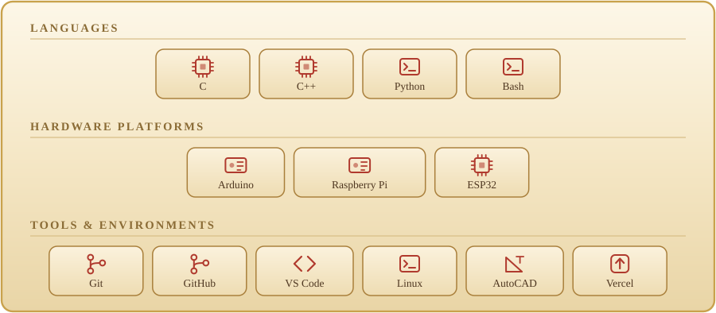
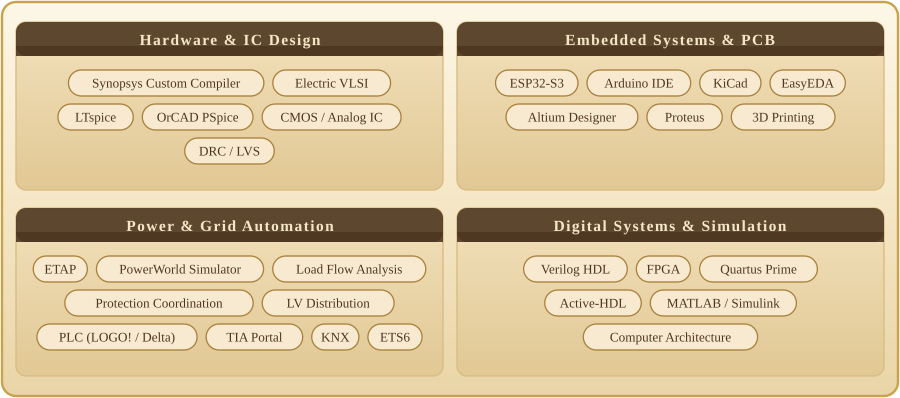
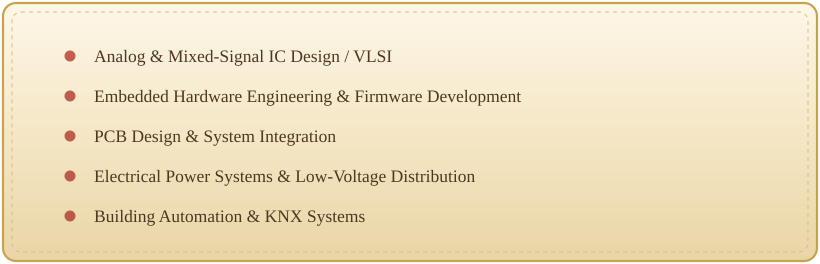

  

  
  
  

  
Electrical Engineering graduate with hands-on experience across IC design, embedded systems, PCB development, and power distribution.

   

  

   

  

  

  

  

  

  

  
  &nbsp;&nbsp;
  

Custom hardware PCB (left) · 3D-printed prototype (right)

**Architected and fabricated a custom multi-layer PCB integrating an ESP32-S3 microcontroller, GNSS receiver, and UWB transceiver modules** 
**Programmed embedded firmware in C/C++ handling real-time sensor fusion, positioning logic, and feedback** 
**Engineered a 3D-printed ergonomic enclosure for real-world daily usage**

    

 

  
  &nbsp;
  
  &nbsp;
  

PowerWorld load-flow analysis · ETAP radial network · TCC protection curves

**Conducted load-flow, short-circuit, and transformer thermal loading studies in PowerWorld; integrated shunt capacitors for reactive power compensation** 
**Modeled radial distribution layouts in ETAP, assessing fault currents and voltage drop during short-circuit events** 
**Calculated CT ratios and protection settings; built primary/backup coordination schemes with breakers, reclosers, and fuses** 
**Constructed TCC curves to verify fault-clearing selectivity and protection margins**

    

 

  
  &nbsp;&nbsp;
  

3D board model (left) · layout &amp; copper routing planes (right)

**Designed power delivery network (PDN), USB-C connectivity, and USB-to-UART bridging** 
**Built footprint libraries from datasheets and optimized trace widths and thermal dissipation** 
**Completed manual routing, ground plane fills, DRC checks, and manufacturing verification**

   

 

  
  &nbsp;&nbsp;
  

Array &amp; readout schematic (left) · SPICE transient response (right)

**Designed core memory cell arrays, address decoding logic, and differential comparator readout stages** 
**Executed layout with strict transistor symmetry to leverage process mismatch for secure key generation** 
**Validated cell stability via SPICE simulation; achieved zero DRC and LVS errors**

   

 

  
  &nbsp;&nbsp;
  

Main distribution panel assembly (left) · power &amp; KNX control wiring (right)

**Calculated branch/main power loads, voltage drops, and cable/busbar requirements** 
**Built and wired a 400 A three-phase distribution panel per standard single-line diagrams** 
**Configured lighting and automation control using KNX devices and ETS6**

   

 

 

<table width="100%">
<tr>
<td width="33%" valign="top" align="center">

  
Designed common-source, common-drain, and differential amplifier stages in Synopsys Custom Compiler. Performed DC, AC, and frequency-response simulations.  

</td>
<td width="33%" valign="top" align="center">

  
Modeled and verified Ripple Carry vs. Carry Look-Ahead adders in Verilog, analyzing worst-case propagation delay.  

</td>
<td width="33%" valign="top" align="center">

  
Designed a custom microcomputer architecture integrating ALU, register files, bus routing, and control logic.  

</td>
</tr>
</table>

 

  

KNX / ETS eCampus &nbsp;·&nbsp; Analog IC Design training at uWave Semiconductor &nbsp;·&nbsp; VLSI &amp; Python coursework

 

  

  

  

  

 

Ramallah, Palestine 🇵🇸

