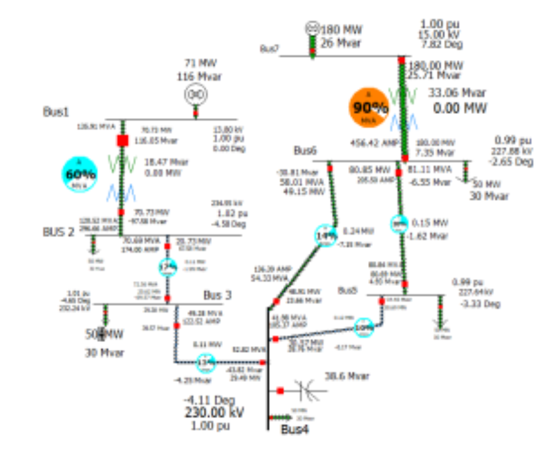
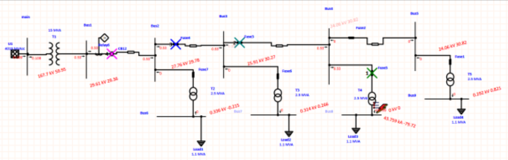
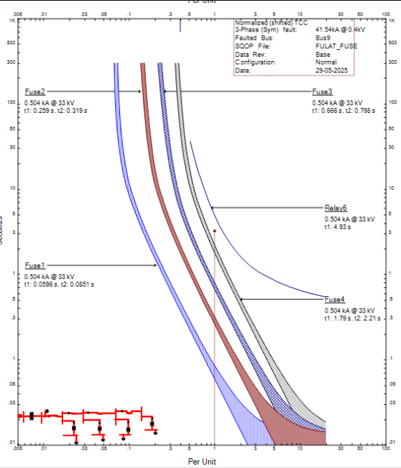

  

  # 👋 Hi, I'm Kareem Taha

  ### Automation · Power Distribution · IC Design ⚡ 🇵🇸

  
  
  

  📍 Ramallah, Palestine

Electrical Engineering graduate with hands-on experience spanning multiple tiers of electrical hardware design — from transistor-level IC/VLSI design and embedded firmware to PCB development, low-voltage power distribution, and building automation.

---

## 🛠️ Technical Capabilities

| ⚡ Hardware & IC Design | 🔌 Embedded Systems & PCB |
|---|---|
|     |     |

| 🏭 Power & Grid Automation | 💻 Digital Systems & Software |
|---|---|
|     |     |

---

## 🚀 Featured Engineering Projects

### 👨‍🦯 PaldiBlind — Assistive Navigation Device

**Graduation Project:** Assistive device combining GNSS outdoor positioning and UWB indoor localization for visually impaired individuals.

  
  &nbsp;&nbsp;
  

Custom hardware PCB (left) · 3D-printed prototype (right)

* Architected and fabricated a custom multi-layer PCB integrating an ESP32-S3 microcontroller, GNSS receiver, and UWB transceiver modules.
* Programmed embedded firmware in C/C++ handling real-time sensor fusion, positioning logic, and feedback.
* Engineered a 3D-printed ergonomic enclosure for real-world daily usage.

    

---

### ⚡ Power System Analysis & Protection Coordination

Complete modeling and protection design of radial distribution networks using ETAP and PowerWorld Simulator.

  
  &nbsp;
  
  &nbsp;
  

PowerWorld load-flow analysis · ETAP radial network · TCC protection curves

* Conducted load-flow, short-circuit, and transformer thermal loading studies in PowerWorld; integrated shunt capacitors for reactive power compensation.
* Modeled radial distribution layouts in ETAP, assessing fault currents and voltage drop during short-circuit events.
* Calculated CT ratios and protection settings; built primary/backup coordination schemes with breakers, reclosers, and fuses.
* Constructed TCC curves to verify fault-clearing selectivity and protection margins.

    

---

### 🎛️ Custom ESP32-WROOM-32 Development Board

Hardware design of a modular microcontroller development platform from schematic capture to finished PCB fabrication files.

  
  &nbsp;&nbsp;
  

3D board model (left) · layout & copper routing planes (right)

* Designed power delivery network (PDN), USB-C connectivity, and USB-to-UART bridging.
* Built footprint libraries from datasheets and optimized trace widths and thermal dissipation.
* Completed manual routing, ground plane fills, DRC checks, and manufacturing verification.

   

---

### 🔒 SRAM PUF Array — Transistor-Level Design

Transistor-level IC design and physical layout verification of a 4×4 SRAM-based Physical Unclonable Function.

  
  &nbsp;&nbsp;
  

Array & readout schematic (left) · SPICE transient response (right)

* Designed core memory cell arrays, address decoding logic, and differential comparator readout stages.
* Executed layout with strict transistor symmetry to leverage process mismatch for secure key generation.
* Validated cell stability via SPICE simulation; achieved zero DRC and LVS errors.

   

---

### 🏢 Melemco — Power Distribution & Building Automation

Practical engineering experience in low-voltage panel assembly, breaker sizing, and smart building integration.

  
  &nbsp;&nbsp;
  

Main distribution panel assembly (left) · power & KNX control wiring (right)

* Calculated branch/main power loads, voltage drops, and cable/busbar requirements.
* Built and wired a 400 A three-phase distribution panel per standard single-line diagrams.
* Configured lighting and automation control using KNX devices and ETS6.

   

---

### 🔬 Additional Engineering Highlights

**📐 Analog IC Training — uWave Semiconductor**
Designed common-source, common-drain, and differential amplifier stages in Synopsys Custom Compiler. Performed DC, AC, and frequency-response simulations.

**⏱️ Multiplier Design — RCA vs. CLA**
Modeled and verified Ripple Carry vs. Carry Look-Ahead adders in Verilog, analyzing worst-case propagation delay.

**💻 Microcomputer Architecture Design**
Designed a custom microcomputer architecture integrating ALU, register files, bus routing, and control logic.

---

## 🎯 Career Focus

Actively seeking graduate and junior engineering roles across:

* Analog & Mixed-Signal IC Design / VLSI
* Embedded Hardware Engineering & Firmware Development
* PCB Design & System Integration
* Electrical Power Systems & Low-Voltage Distribution
* Building Automation & KNX Systems

---

📫 **Let's Connect**

Ramallah, Palestine 🇵🇸

